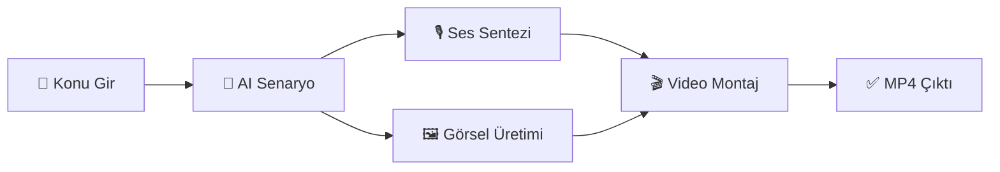

# 🎬 AI Video Bot — Yapay Zeka Video Otomasyon Sistemi

<div align="center">

Yapay zeka kullanarak **bilgilendirici kısa videolar** (YouTube Shorts, Instagram Reels, TikTok) oluşturan tam otomatik bir sistemdir.

**Konu girin → Senaryo yazılır → Ses üretilir → Görseller indirilir → Video montajlanır → İzleyin! 🚀**


</div>

---

## 📸 Ekran Görüntüsü

<div align="center">
  
  <p><em>Koyu tema, modern ve şık kontrol paneli</em></p>
</div>

---

## ✨ Özellikler

| Özellik | Açıklama |
|---------|----------|
| 🤖 **Çoklu AI Desteği** | Senaryo için Gemini 2.5 Pro veya OpenAI GPT-4o-mini seçimi |
| 🎙️ **Ücretsiz Seslendirme** | Edge-TTS ile doğal Türkçe/İngilizce sesler |
| 🖼️ **Ücretsiz Görsel Üretimi** | Pollinations.ai entegrasyonu |
| 🎬 **Otomatik Montaj** | MoviePy ile görseller + ses + altyazı birleştirme |
| 📝 **TikTok Tarzı Altyazılar** | Kalın, renkli, gölgeli altyazılar otomatik eklenir |
| 📊 **Web Dashboard** | Konu ekle, ilerlemeyi takip et, videoları izle ve indir |
| 📥 **Toplu Import** | Birden fazla konuyu aynı anda kuyruğa ekle |
| 🌍 **Çok Dilli** | Türkçe ve İngilizce video desteği |
| ⏱️ **Esnek Süre** | 30, 45 veya 60 saniyelik video seçenekleri |

---

## 🛠️ Kurulum

### Gereksinimler

- Python 3.10 veya üzeri
- FFmpeg (video işleme için)
- Git

### 1. Repoyu Klonla

```bash
git clone https://github.com/sdt-cloud/ai-video-bot.git
cd ai-video-bot
```

### 2. Sanal Ortam Oluştur ve Bağımlılıkları Kur

```bash
python -m venv venv

# Windows
.\venv\Scripts\activate

# macOS / Linux
source venv/bin/activate

pip install -r requirements.txt
```

### 3. API Anahtarlarını Ayarla

```bash
cp .env.example .env
```

`.env` dosyasını açın ve kendi API anahtarlarınızı girin:

| Anahtar | Nereden Alınır? | Zorunlu mu? |
|---------|-----------------|-------------|
| `GEMINI_API_KEY` | [Google AI Studio](https://aistudio.google.com/apikey) | ✅ Evet (Gemini kullanacaksanız) |
| `OPENAI_API_KEY` | [OpenAI Platform](https://platform.openai.com) | ❌ Hayır (Opsiyonel) |

> 💡 **İpucu:** Gemini API anahtarı ücretsiz alınabilir!

### 4. Başlat!

```bash
# Yöntem 1: Windows - start.bat dosyasına çift tıklayın

# Yöntem 2: Terminal
python -m uvicorn app:app --host 0.0.0.0 --port 8000
```

Tarayıcıda **http://localhost:8000** adresini açın. 🎉

---

## 📁 Proje Yapısı

```
ai-video-bot/
├── 📄 app.py                 # FastAPI backend sunucusu
├── 📄 database.py            # SQLite veritabanı yönetimi
├── 📄 script_generator.py    # AI senaryo üretici (Gemini/OpenAI)
├── 📄 voice_generator.py     # Edge-TTS ses sentezi
├── 📄 image_generator.py     # Pollinations.ai görsel indirici
├── 📄 video_maker.py         # MoviePy video montajı + altyazı
├── 📄 main.py                # Komut satırı (CLI) arayüzü
├── 📄 start.bat              # Windows başlatma dosyası
├── 📄 requirements.txt       # Python bağımlılıkları
├── 📄 .env.example           # Örnek ortam değişkenleri
├── 📂 docs/                  # Belgelendirme ve görseller
│   └── dashboard-preview.png
└── 📂 frontend/              # Web arayüzü
    ├── index.html             # Dashboard arayüzü
    ├── style.css              # Koyu tema stilleri
    └── app.js                 # Frontend mantığı
```

---

## 🔄 Nasıl Çalışır?



1. **Konu Girişi** — Dashboard üzerinden konu yazın
2. **Senaryo Üretimi** — Gemini/OpenAI sahne sahne senaryo yazar
3. **Ses Sentezi** — Edge-TTS doğal sesle metni sese çevirir
4. **Görsel İndirme** — Pollinations.ai sahne başına görsel üretir
5. **Video Montaj** — MoviePy ile ses, görseller ve altyazılar birleştirilir
6. **Çıktı** — İzlenebilir MP4 formatında video hazır!

---

## 💰 Maliyet

| Bileşen | Araç | Maliyet |
|---------|------|---------|
| 📝 Senaryo | Gemini 2.5 Pro | ✅ Ücretsiz (API kotası) |
| 🎙️ Seslendirme | Edge-TTS | ✅ Ücretsiz |
| 🖼️ Görseller | Pollinations.ai | ✅ Ücretsiz |
| 🎬 Video Montaj | MoviePy + FFmpeg | ✅ Ücretsiz |

> 💡 **Başlangıç maliyeti: $0** — Tamamen ücretsiz araçlarla çalışır!

---

## 🗺️ Yol Haritası

- [x] Komut satırı (CLI) ile video üretimi
- [x] Web Dashboard arayüzü
- [x] Çoklu AI model desteği (Gemini + OpenAI)
- [x] Toplu konu ekleme (Bulk Import)
- [x] TikTok tarzı altyazılar
- [ ] YouTube otomatik yükleme
- [ ] Zamanlayıcı (Cron ile otomatik üretim)
- [ ] Sosyal medya hesap yönetimi
- [ ] Video şablonları (intro, outro)

---

## 🤝 Katkıda Bulunma

Katkıda bulunmak istiyorsanız [CONTRIBUTING.md](CONTRIBUTING.md) dosyasına göz atın.

Her türlü katkı — bug raporu, özellik önerisi veya pull request — memnuniyetle karşılanır! ⭐

---

## 📄 Lisans

Bu proje [MIT Lisansı](LICENSE) ile lisanslanmıştır — dilediğiniz gibi kullanabilirsiniz.

---

<div align="center">

**⭐ Beğendiyseniz yıldız vermeyi unutmayın! ⭐**

Made with ❤️ and AI

</div>
