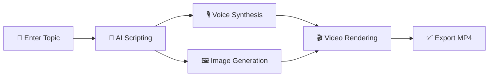

# 🎬 AI Video Bot — Automated AI Video Production System

<div align="center">

A fully automated system that creates **informative short videos** (YouTube Shorts, Instagram Reels, TikTok) using Artificial Intelligence.

**Enter a Topic → Script is Written → Voice is Synthesized → Images are Generated → Video is Rendered → Watch! 🚀**

[](https://www.python.org)
[](https://fastapi.tiangolo.com)
[](https://aistudio.google.com)
[](LICENSE)
[](#)

[Türkçe README](README.md) • [Report Bug](https://github.com/sdt-cloud/ai-video-bot/issues/new?assignees=&labels=bug&projects=&template=bug_report.yml) • [Request Feature](https://github.com/sdt-cloud/ai-video-bot/issues/new?assignees=&labels=enhancement&projects=&template=feature_request.yml)

</div>

---

## 📸 Screenshot

<div align="center">
  
  <p><em>Dark mode, modern, and sleek control panel</em></p>
</div>

---

## ✨ Features

| Feature | Description |
|---------|-------------|
| 🤖 **Multi-AI Support** | Select Gemini 2.5 Pro or OpenAI GPT-4o-mini for script writing |
| 🎙️ **Free Voice Synthesis** | Edge-TTS integration for highly natural Turkish/English speech |
| 🖼️ **Free Image Generation** | Pollinations.ai integration for infinite on-demand images |
| 🎬 **Automatic Video Editing** | MoviePy merges images + voice + dynamic subtitles automatically |
| 📝 **TikTok-Style Subtitles** | Bold, colorful, shadow-bordered subtitles automatically positioned |
| 📊 **Web Dashboard** | Add topics, track progress, watch and download rendered videos |
| 📥 **Bulk Import** | Add multiple topics at once to a background job queue |
| 🌍 **Multi-lingual Support** | Create videos in Turkish, English, Spanish and more |
| ⏱️ **Flexible Duration** | Choose video durations from 15 seconds up to 5 minutes |
| 🎵 **Beat-Sync Editing** | Automatically synchronize transitions with background music beats |

---

## 🛠️ Installation

### Prerequisites

- Python 3.10 or higher
- FFmpeg (critical for video and audio rendering)
- Git

### 1. Clone the Repository

```bash
git clone https://github.com/sdt-cloud/ai-video-bot.git
cd ai-video-bot
```

### 2. Create Virtual Environment & Install Dependencies

```bash
python -m venv venv

# Windows
.\venv\Scripts\activate

# macOS / Linux
source venv/bin/activate

pip install -r requirements.txt
```

### 3. Configure API Keys

```bash
cp .env.example .env
```

Open the `.env` file and enter your API keys:

| Key | Where to Get? | Required? |
|-----|----------------|-----------|
| `GEMINI_API_KEY` | [Google AI Studio](https://aistudio.google.com/apikey) | ✅ Yes (If using Gemini) |
| `OPENAI_API_KEY` | [OpenAI Platform](https://platform.openai.com) | ❌ No (Optional) |

> 💡 **Tip:** Gemini API key can be obtained completely for free!

### 4. Running the Application

#### Option A: Running with Docker (Recommended)

Make sure you have Docker and Docker Compose installed, then run:

```bash
docker-compose up --build -d
```
The dashboard will be available at **http://localhost:8001**! 🎉

#### Option B: Running Locally

```bash
# Windows
start.bat

# macOS / Linux / Terminals
python -m uvicorn app:app --host 0.0.0.0 --port 8001
```

Open your browser and navigate to **http://localhost:8001**.

---

## 📁 Directory Structure

```
ai-video-bot/
├── 📄 app.py                 # FastAPI backend server
├── 📄 database.py            # SQLite database manager
├── 📄 script_generator.py    # AI script writer (Gemini/OpenAI)
├── 📄 voice_generator.py     # Edge-TTS voice synthesizer
├── 📄 image_generator.py     # Pollinations.ai image generator
├── 📄 video_maker.py         # MoviePy video rendering + subtitles
├── 📄 main.py                # Command Line (CLI) interface
├── 📄 start.sh               # Shell script launcher
├── 📄 start.bat              # Windows batch launcher
├── 📄 requirements.txt       # Python dependencies
├── 📄 .env.example           # Example environment variables
├── 📂 docs/                  # Documentation & visual assets
│   └── dashboard-preview.png
└── 📂 frontend/              # Frontend web application
    ├── index.html            # Web Dashboard UI
    ├── style.css             # Dark theme styles
    └── app.js                # Frontend client logic
```

---

## 🔄 How it Works



1. **Topic Input** — Input a prompt or topic from the web dashboard or CLI.
2. **AI Scripting** — Gemini/OpenAI creates a scene-by-scene script with timing, narration, and visual prompts.
3. **Voice Synthesis** — Edge-TTS converts scene narrations to speech audio.
4. **Image Generation** — Pollinations.ai or DALL-E produces stunning relevant visuals for each scene.
5. **Video Rendering** — MoviePy layers audio, visuals, transitions, dynamic subtitles, and post-effects into one video track.
6. **Export** — High-quality MP4 video is rendered and saved to the dashboard library!

---

## 💰 Production Cost

| Component | Tool / Provider | Cost |
|-----------|-----------------|------|
| 📝 Scripting | Gemini 2.5 Pro | ✅ **$0.00** (Free API Tier) |
| 🎙️ Voice | Edge-TTS | ✅ **$0.00** (Unlimited Free) |
| 🖼️ Visuals | Pollinations.ai | ✅ **$0.00** (Unlimited Free) |
| 🎬 Rendering | MoviePy + FFmpeg | ✅ **$0.00** (Open-Source Engine) |

> 💡 **Production cost per video is exactly $0.00!** Make as many videos as you want completely free of charge.

---

## 🗺️ Roadmap

- [x] Command Line (CLI) interactive generation
- [x] Modern Web Dashboard UI
- [x] Multi-AI script generation (Gemini + OpenAI)
- [x] Bulk Topic Import
- [x] Dynamic TikTok-Style subtitling
- [x] Dockerization & container orchestration
- [ ] Auto-upload to YouTube Shorts / TikTok
- [ ] Automatic Scheduler (Cron-based scheduling)
- [ ] Multiple social account profiles
- [ ] Video layout templates (Intros & Outros)

---

## 🤝 Contributing

Contributions are what make the open source community such an amazing place to learn, inspire, and create. Any contributions you make are **greatly appreciated**!

Please check [CONTRIBUTING.md](CONTRIBUTING.md) for developers setup and contribution standards.

---

## 📄 License

Distributed under the MIT License. See [LICENSE](LICENSE) for more information.

---

<div align="center">

**⭐ If you like this project, please give it a star! ⭐**

Made with ❤️ and AI

</div>
